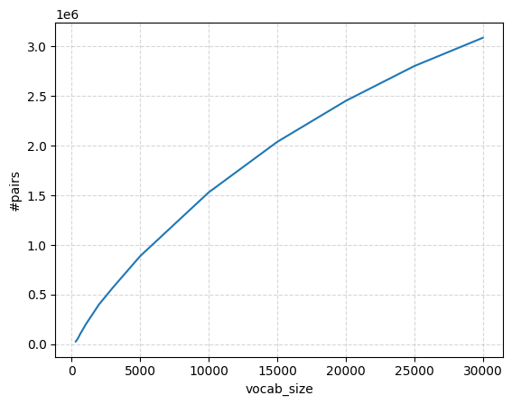

## Solutions

### Problem(unicode1): Understanding Unicode (1 point)

(a) `chr(0)` is the Unicode character U+0000, which is called the NUL (Null) character with length=1. In python interpreter, It will return '\x00', but if we print it using `print(chr(0))`, we will get nothing visible.


(b) `repr(chr(0))` will return"'\\\x00'", this allows developers to see and reason about otherwise invisible characters. It is designed for developers and debugging.


(c) `print()`shows the contents of a string, while `repr()` shows the string as a string. `print()`or`str()`is designed for human-readable output, it shows the value of the object.

### Problem (unicode2): Unicode Encodings (3 points)

(a) More common in real world text、more compact (shorter sequence)、less 0 bytes (wasteful).

(b) `decode_utf8_bytes_to_str_wrong("你好".encode("utf-8"))` will produce wrong output. Because one byte does not necessarily correspond to one Unicode character!

(c) My example is:

```python
bytes([228, 189]) # b'\xe4\xbd'
```

This does not decode to any Unicode character in UTF-8, because 0xE4 (1110xxxx) indicates the start of a 3-byte UTF-8 sequence, but only one continuation byte (0xBD) follows.

```python
>>> bytes([228, 189, 160]).decode("utf-8")
'你'
>>> bytes([228, 189]).decode("utf-8")
---------------------------------------------------------------------------
UnicodeDecodeError                        Traceback (most recent call last)
Cell In[50], line 1
----> 1 bytes([228, 189]).decode("utf-8")

UnicodeDecodeError: 'utf-8' codec can't decode bytes in position 0-1: unexpected end of data
```

### Problem (train_bpe_tinystories): BPE Training on TinyStories (2 points)
(a) It takes me 125.79 seconds and 0.121G memory to train BPE on tinystores. The longest token in the vocab is `'Ġaccomplishment'`, which make sense.  
(b) The step `_select_pair` function takes the most time, which is 90 seconds. Besides, `_build_word_freq` takes 30 seconds.

**version 2: Using heap to select best pair**

(a) It takes me 42.39 seconds and 0.219G memory to train BPE on tinystores. The longest token in the vocab is `'Ġaccomplishment'`, which make sense.  
(b) The step `_build_word_freq` function takes the most time, which is 30 seconds. 

### Problem (train_bpe_expts_owt): BPE Training on OpenWebText (2 points)
(a) It takes me 7569 seconds and 24.34 G memory to train BPE, the logs during training can be found at [here](logs/train_bpe_owt_log.txt).   
<table>
<tr>
<td>


</td>
<td>



</td>
</tr>
</table>

The longest token in the vocab is `'ÃĥÃĤÃĥÃĤÃĥÃĤÃĥÃĤÃĥÃĤÃĥÃĤÃĥÃĤÃĥÃĤÃĥÃĤÃĥÃĤÃĥÃĤÃĥÃĤÃĥÃĤÃĥÃĤÃĥÃĤÃĥÃĤ'`, and this does make sense for a byte-level BPE tokenizer.

This token is not meant to represent a readable character or word. It is a high-frequency byte sequence that appears repeatedly in the training corpus. The pattern `ÃĥÃĤ` corresponds to a specific UTF-8 byte sequence that commonly arises from misinterpreted or re-encoded UTF-8 text (often called mojibake).

(b) By running this [script](scripts/compare_vocabs.py), we can conclude their key differences are:
``` txt
== TinyStories ==
vocab size: 10000
max token length: 15
ASCII-only ratio: 0.9852
longest tokens:
  Ġaccomplishment
  Ġdisappointment
  Ġresponsibility
  Ġuncomfortable
  Ġcompassionate

== OpenWebText ==
vocab size: 32000
max token length: 64
ASCII-only ratio: 0.98253125
longest tokens:
  ÃĥÃĤÃĥÃĤÃĥÃĤÃĥÃĤÃĥÃĤÃĥÃĤÃĥÃĤÃĥÃĤÃĥÃĤÃĥÃĤÃĥÃĤÃĥÃĤÃĥÃĤÃĥÃĤÃĥÃĤÃĥÃĤ
  ----------------------------------------------------------------
  âĢĶâĢĶâĢĶâĢĶâĢĶâĢĶâĢĶâĢĶâĢĶâĢĶâĢĶâĢĶâĢĶâĢĶâĢĶâĢĶ
  --------------------------------
  ________________________________

== Overlap ==
shared tokens: 7319
only TinyStories: 2681
only OpenWebText: 24681
```
 - The TinyStories tokenizer learns mostly short, human-readable English word and subword tokens, reflecting the clean, simple, and homogeneous nature of the corpus. 
 - The OpenWebText tokenizer learns a much larger and more diverse vocabulary, including very long byte-level tokens and noisy UTF-8 artifacts, capturing the heterogeneous, messy, and web-scale characteristics of internet text.

### Problem (tokenizer_experiments): Experiments with tokenizers (4 points)
Below are the outputs produced by from this [script](scripts/tokenizer_experiments.py).
```
================ problem (a) ================
TS data + TS tok: total_bytes: 9170, total_tokens: 2225 => compression_ratio: 4.1213 bytes/token
OWT data + OWT tok: total_bytes: 23892, total_tokens: 5335 => compression_ratio: 4.4784 bytes/token
================ problem (b) ================
OWT data + TS tok: total_bytes: 23892, total_tokens: 7577 => compression_ratio: 3.1532 bytes/token
TS data + OWT tok total_bytes: 9170, total_tokens: 2286 => compression_ratio: 4.0114 bytes/token
================ problem (c) ================
OWT tokenizer throughput: 3.91 MB/s
Estimated time for 825GB: 58.60 hours (2.44 days)
(optional) tokens/sec: 0.90 M tokens/s
```
(a) On 10 sampled documents, the TinyStories tokenizer achieves 4.1213 bytes/token on TinyStories and the OpenWebText tokenizer achieves 4.4784 bytes/token on OpenWebText.

(b) Tokenizing the OpenWebText sample with the TinyStories tokenizer yields a substantially worse compression ratio (3.1532 bytes/token vs 4.4784 bytes/token), indicating the smaller, domain-specific TinyStories vocabulary splits OpenWebText text into many more (shorter) tokens.

(c) The OpenWebText tokenizer runs at about 3.91 MB/s, so tokenizing the 825GB Pile would take approximately 58.6 hours (~2.44 days).

(d) uint16 is appropriate because it can represent token IDs in the range 0–65535, which safely covers vocabularies of 10K and 32K, while halving storage and I/O cost relative to int32.

### Problem (transformer_accounting): Transformer LM resource accounting (5 points)
Let the model configuration be defined as follows:  
	•	V: vocabulary size  
	•	S: sequence length (context length)  
	•	B: batch size  
	•	N: number of Transformer blocks (layers)  
	•	D: model dimension (d_model)  
	•	H: number of attention heads  
	•	D_h = D / H: per-head dimension  
	•	F: feed-forward hidden dimension (d_ff)

**FLOPs**

$$
\mathrm{FLOPs}
=2BSDV+N(4BSDF+8BSD^2+4BS^2D).
$$

**Number of Trainable Parameters**

$$
\#\text{params}
=2VD+D+N(3DF+4D^2+2D).
$$

*Assumes no weight tying, no bias terms, RMSNorm, and RoPE with no trainable parameters.*

(a) #trainable params = 2.13B.  
 1 param = 4 bytes, memory = 8.1G, this is just for model parameters (no optimizer state, activations, gradients, or KV cache)

(b) FLOPs are reported per sequence, ignoring the batch size B：
| Component | Matrix Multiplies| FLOPs | |
|---|---|---:|---|
| **Attention** | Q/K/V/O projection + Attention scores  + Attention weighted sum  | N(8BSD^2+4BS^2D) | 1.33T |
| **FFN (SwiGLU)** | Up-projection + Gate projection + Down-projection  | N(6BSDF) | 3.02T |
| **LM head** | Vocabulary projection | 2BSDV | 0.17T |
| **Total** |  | 2BSDV + N(6BSDF + 8BSD^2 + 4BS^2D) | 4.51T |

(c) FFN equire the most FLOPs.  
(d) Suppose that d_ff = 4*d_model, the FLOPs of these three models are as follows:
| model  | **Attention**   | **FFN (SwiGLU)**  | **LM head**  | **Total** |
|---|---|---|---|---|
| GPT-2 small (12 layers, 768 d_model, 12 heads)  | 96.64B(28%)  | 173.951B(50%)  | 79.05B(23%)  | 349.63B  |
| GPT-2 medium (24 layers, 1024 d_model, 16 heads)  | 309.23B(30%)  | 618.48B(60%)  | 105.40B(10%)  | 1033.11B  |
|  GPT-2 large (36 layers, 1280 d_model, 20 heads) | 676.46B(30%)  | 1449.55B(64%)  | 131.75B(6%)  | 2257.75B  |

As model size increases, the FFN share grows (about 50% → 60% → 64%) while the lm_head share shrinks sharply (about 23% → 10% → 6%) because per-layer compute scales roughly like ND^2, whereas lm_head scales like D (for fixed S,V). The attention share stays roughly flat (~28–30%) since both FFN and attention are dominated by D^2-scaling terms at these sizes.

(e) Increasing the context length of GPT-2 XL from 1,024 to 16,384 raises the total FLOPs for a single forward pass from about 4.51 trillion to 149.52 trillion FLOPs (≈ 33× increase). As context length grows, the attention component overwhelmingly dominates the total FLOPs due to its S^2 scaling, while the relative contributions of the FFN and lm_head—which scale only linearly with S—shrink substantially.
| model  | **Attention**   | **FFN (SwiGLU)**  | **LM head**  | **Total** |
|---|---|---|---|---|
| GPT-2 XL with S=1,024  | 1.33T(29%)  | 3.02T(67%)  | 79.05B(4%)  | 4.51T  |
| GPT-2 XL with S=16,384  | 98.57T(66%)  | 48.32T(32%)  | 2.63T(2%)  | 149.52T  |

### Problem (learning_rate_tuning): Tuning the learning rate (1 point)

1. With a learning rate of 1e1, the loss decreases steadily and remains stable throughout training.
2. A learning rate of 1e2 causes the loss to drop extremely rapidly to near zero, indicating overly aggressive updates and numerical instability.  
(At a learning rate of 1e2, the optimizer no longer performs a meaningful gradient descent; instead, the overly large updates push the model into a numerically saturated regime where the loss collapses and gradients effectively vanish, resulting in a degenerate solution rather than true convergence.)
3. In contrast, a learning rate of 1e3 leads to rapid divergence, with the loss exploding over successive training steps.

| Step | lr = 1e1 | lr = 1e2 | lr = 1e3 |
|-----:|---------:|---------:|---------:|
| 1 | 25.99 | 20.35 | 29.11 |
| 2 | 16.63 | 20.35 | 1.05×10⁴ |
| 3 | 12.26 | 3.49 | 1.81×10⁶ |
| 4 | 9.59 | 8.36×10⁻² | 2.02×10⁸ |
| 5 | 7.77 | 1.94×10⁻¹⁶ | 1.64×10¹⁰ |
| 6 | 6.44 | 2.17×10⁻¹⁸ | 1.03×10¹² |
| 7 | 5.43 | 7.30×10⁻²⁰ | 5.30×10¹³ |
| 8 | 4.64 | 4.35×10⁻²¹ | 2.28×10¹⁵ |
| 9 | 4.01 | 3.73×10⁻²² | 8.40×10¹⁶ |
| 10 | 3.49 | 4.14×10⁻²³ | 2.70×10¹⁸ |


### Problem (adamwAccounting): Resource accounting for training with AdamW (2 points)
(a) Let 
- V: vocabulary size
- N: the number of layers
- D: the model dimension
- S: the sequence length
- B: the batch size
- F: d_ff which is equal to 4D. 

We assume untied input/output embeddings, RoPE positional encoding, a SiLU-based feed-forward network, RMSNorm without bias, and float32 precision.

#### Parameter-related Memory

The parameter-related memory consists of **model parameters**, **gradients**, and **AdamW optimizer states**. Since gradients and the first- and second-moment estimates have the same shape as the parameters, their memory usage can be expressed as a constant multiple of the number of parameters.

The total number of parameters is approximately
$P = 2VD + D + N(12D^2 + 2D)$.
Thus, the peak parameter-side memory required by AdamW (excluding activations) is
$$
\text{Parameter-side memory (GB)} \approx
\frac{4 * 4\big(2VD + D + N(12D^2 + 2D)\big)}{1024^3}
$$
 
#### Activation Memory

| Level-1 Module | Level-2 Component | Source (Forward Operation) | Purpose in Backward | #Elements |
|---------------|-------------------|----------------------------|---------------------|-----------|
| **RMSNorm (per block)** | Pre-attn RMSNorm input | Input to attention RMSNorm | RMSNorm backward | $N \cdot BSD$ |
| | Pre-FFN RMSNorm input | Input to FFN RMSNorm | RMSNorm backward | $N \cdot BSD$ |
| **Self-Attention (per block)** | Query (Q) | Linear projection $XW_Q$ | Gradients for $W_Q$ | $N \cdot BSD$ |
| | Key (K) | Linear projection $XW_K$ | Gradients for $W_K$ | $N \cdot BSD$ |
| | Value (V) | Linear projection $XW_V$ | Gradients for $W_V$ | $N \cdot BSD$ |
| | Attention scores | Matrix multiply $QK^\top$ | Softmax backward | $N \cdot BHS^2$ |
| | Softmax probabilities | $\mathrm{softmax}(QK^\top)$ | Attention backward | $N \cdot BHS^2$ |
| | Attention output | $\mathrm{softmax}(QK^\top)V$ | Output projection backward | $N \cdot BSD$ |
| | Output projection output | Linear projection $OW_O$ | Residual / next layer | $N \cdot BSD$ |
| **Feed-Forward (per block)** | W1 output | First matmul $XW_1$ | SiLU backward | $N \cdot BSF$ |
| | SiLU activation output | $\mathrm{SiLU}(XW_1)$ | FFN backward | $N \cdot BSF$ |
| | W2 output | Second matmul | Gradient propagation | $N \cdot BSD$ |
| **Final RMSNorm** | Final RMSNorm input | Input to final RMSNorm | RMSNorm backward | $BSD$ |
| **Output Layer** | Logits | Output embedding projection | Cross-entropy backward | $BSV$ |
| **Cross-Entropy** | CE intermediate | Softmax / log-softmax | CE backward | $cBSV$ ｜

Here, $cBSV$ represents the activation memory used by the cross-entropy loss, where $c$ depends on whether additional softmax or log-softmax tensors are stored. In practice, cross-entropy loss is typically implemented in a fused manner, reusing the logits produced by the output layer and not storing extra intermediate tensors, so $c = 0$.

$$
\text{Activation memory (GB)} \approx
\frac{4\left[N(16BSD + 2BHS^2) + BSD + BSV\right]}{1024^3}.
$$

(b) Mem(GB) = 24.37 + 14.26 * Batch_size, the maximum batch size you can use and still fit within 80GB memory is floor(3.9) = 3.

(c) We count add/mul/div/sqrt as 1 FLOP each and ignore the cost of bias-correction scalars
(computed once per step, not per parameter).

| Step | Update Equation | FLOPs (per parameter) |
|------|------------------|-----------------------|
| First moment | $$m \leftarrow \beta_1 m + (1-\beta_1) g$$ | $$3$$ |
| Second moment | $$v \leftarrow \beta_2 v + (1-\beta_2) g^2$$ | $$4$$ |
| Normalize & update | $$p \leftarrow p - \alpha_t \frac{m}{\sqrt{v}+\epsilon}$$ | $$5$$ |
| Weight decay | $$p \leftarrow p - \alpha \lambda p \;$$ | $$1$$ |
| **Total** |  | $$\approx 13$$ |

**Overall:** for \(P\) parameters,
$$
\text{FLOPs}_{\text{AdamW}} \approx 13P = \Theta(P).
$$

(d) We assume untied input/output embeddings, RoPE positional encoding, a SiLU-based feed-forward network, RMSNorm without bias.

$$
\mathrm{FLOPs}_{\text{forward}}
=2BSDV+N(4BSDF+8BSD^2+4BS^2D).
$$

FLOPs(forward) = 3591T

FLOPs(forward + backward) = 3 x 3591 = 10773T
$$
\#\text{params}
=2VD+D+N(2DF+4D^2+2D).
$$

FLOPs(AdamW) = 13 * #params = 0.02T 

total FLOPs = 10773T

$$
\text{total days}
=\frac{10773 \times 400000}
{0.5 \times 19.5 \times 3600 \times 24}
=5120.
$$


## Notes

1. Unicode code point 定义“是什么字符”，

   Unicode encoding 定义“这个字符如何变成字节”。

2. 在 Python 中，bytes() 和 encode() 的关系可以用一句话概括：

   - encode() 是 str → bytes 的“专用接口”，语义明确、只做一件事、是str的方法

   - bytes() 是更通用、更底层的构造器、语义多态，可以：

     - 从 int 创建缓冲区
     - 从 iterable[int] 创建字节
     - 从 bytearray 冻结
     - 从 str + encoding 编码

     

